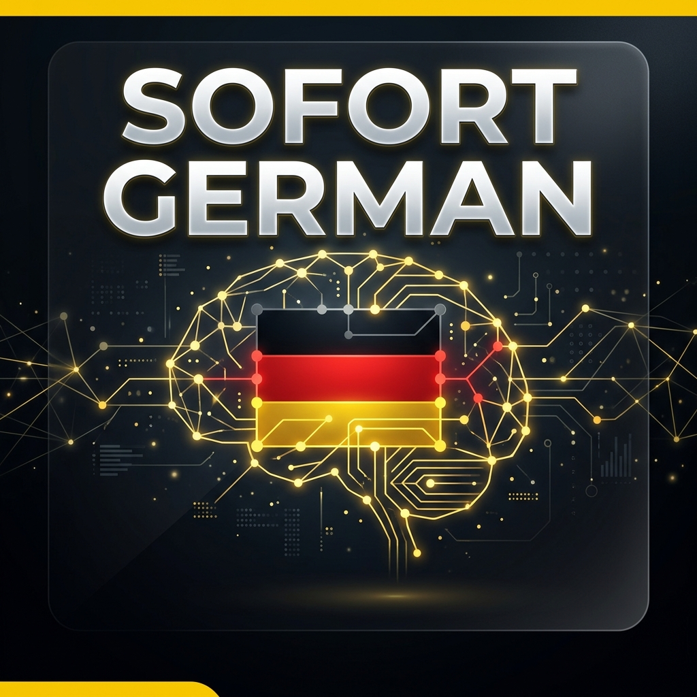

# 🇩🇪 Sofort German - AI Vocabulary PWA



### **Transform your German learning experience with AI-powered "Immediate" (Sofort) immersion.**

**Sofort German** is a high-performance, offline-first Progressive Web App (PWA) designed for serious learners who want to bridge the gap between textbook vocabulary and natural fluency. Using **Groq-powered Llama 3.3 Intelligence**, it scans your textbooks and turns them into interactive training sessions instantly.

---

## 🚀 Key Features

### 🧠 **AI-Powered PDF Scanner**
*   **Coordinate-Precise Detection**: Automatically reconstructs multi-column textbook layouts with surgical precision.
*   **Groq AI Boost**: Uses **Llama 3.3 (70B)** to intelligently clean scrambled text, handle articles, and ignore exercise noise.
*   **No Copy-Paste**: Just upload your PDF and start training in seconds.

### 🎧 **Shadow Listening Engine**
*   **Ear Training**: Adjustable intervals and text-hiding mode to force your brain to recognize spoken German patterns.
*   **Difficulty Filtering**: Focus your sessions on A1, A2, or your custom Imported vocabulary.
*   **Seamless Playback**: Built on the Web Speech API for low-latency, crystal-clear pronunciation.

### 🗣️ **Active Pronunciation Check**
*   **Live Recognition**: Real-time validation of your speech patterns using advanced browser STT.
*   **Instant Feedback**: Visual cues to let you know if your pronunciation is native-level or needs work.

### 📱 **PWA & Offline-First**
*   **IndexedDB Sync**: All your vocabulary stays on your device. No cloud needed (except for the AI Boost).
*   **Installable**: Install it on your Home Screen for a native mobile experience.
*   **Glassmorphic Design**: A premium, sharp-yellow and deep-black aesthetic optimized for focus and night study.

---

## 🛠️ Tech Stack

*   **Core**: [Next.js 14/15](https://nextjs.org/) (App Router)
*   **Intelligence**: [Groq SDK](https://groq.com/) (Llama-3.3-70b-versatile)
*   **Database**: [Dexie.js](https://dexie.org/) (IndexedDB Wrapper)
*   **Parser**: [pdfjs-dist](https://github.com/mozilla/pdf.js)
*   **Icons**: [Lucide React](https://lucide.dev/)
*   **Animations**: Framer Motion & CSS Micro-animations

---

## ⚙️ Quick Start

1. **Clone & Install**
   ```bash
   git clone https://github.com/dj2313/sofort-german-pwa.git
   cd sofort-german-pwa
   npm install
   ```

2. **Set Environment Variables**
   Create a `.env` file in the root:
   ```env
   GROQ_API_KEY=your_key_here
   ```

3. **Run Locally**
   ```bash
   npm run dev
   ```

---

## 🌐 Deployment

Perfectly optimized for **Vercel**.
1. Import the repository.
2. Add your `GROQ_API_KEY` to the environment variables.
3. Deploy!

---

## 📜 License
MIT - Created by [dj2313](https://github.com/dj2313)

---

### *Master German. Sofort.*
